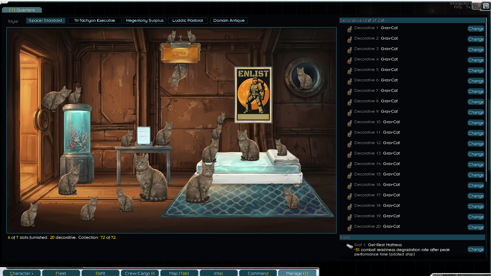
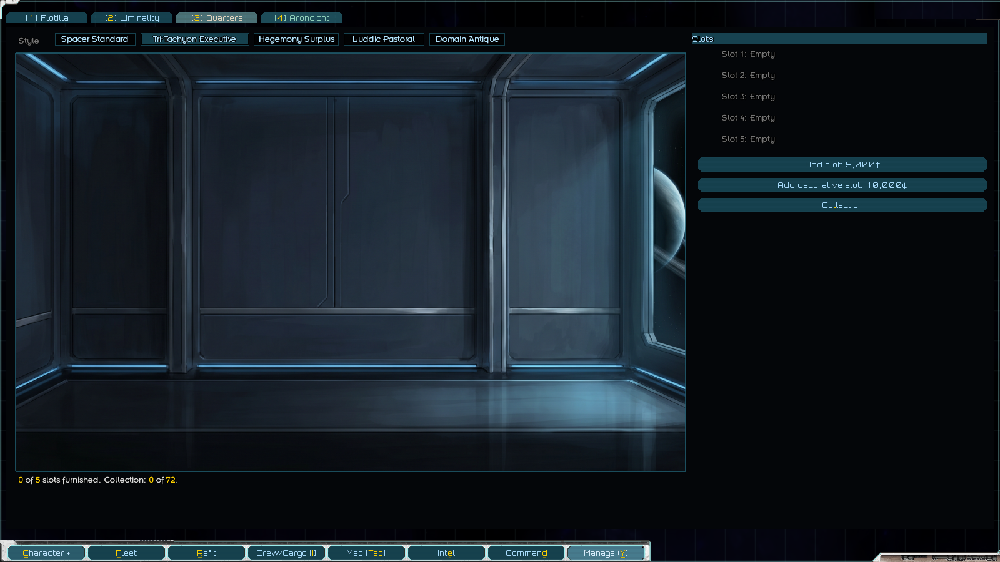
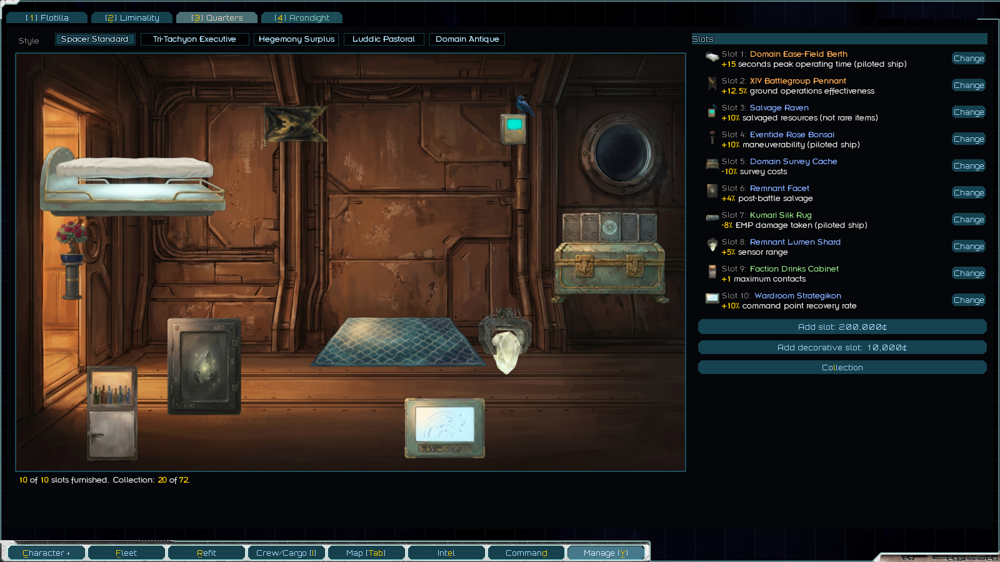
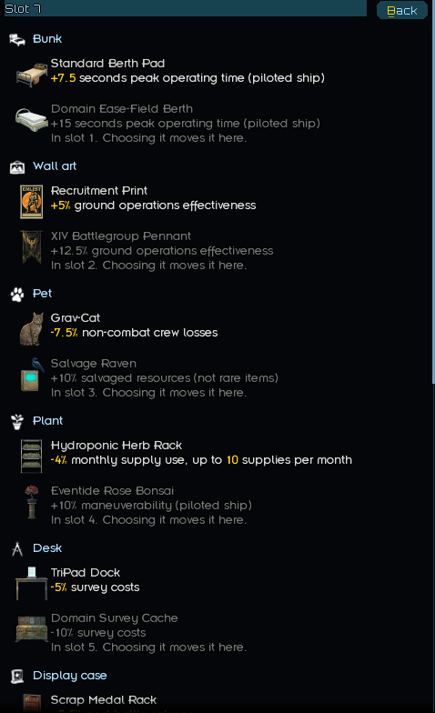

# Captain's Quarters
> The cat outranks you.

Design your cabin, on the Management screen. Furnish it with things you pick up in your travels, arrange them how you like, restyle the room, add decorative slots.

Furnishings turn up in market stock, in old stations, in battle salvage, and as quest rewards.

No required dependencies. Can be added to existing saves.

Forum link: TODO

## Screenshots

